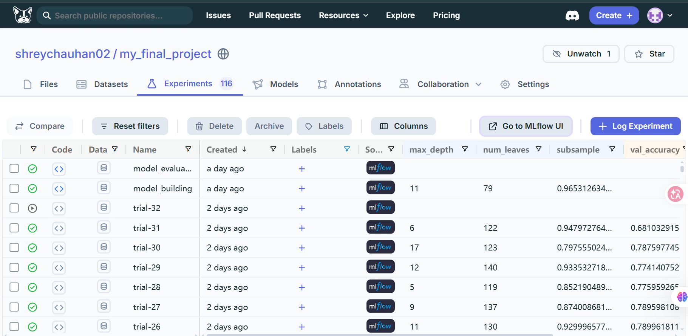
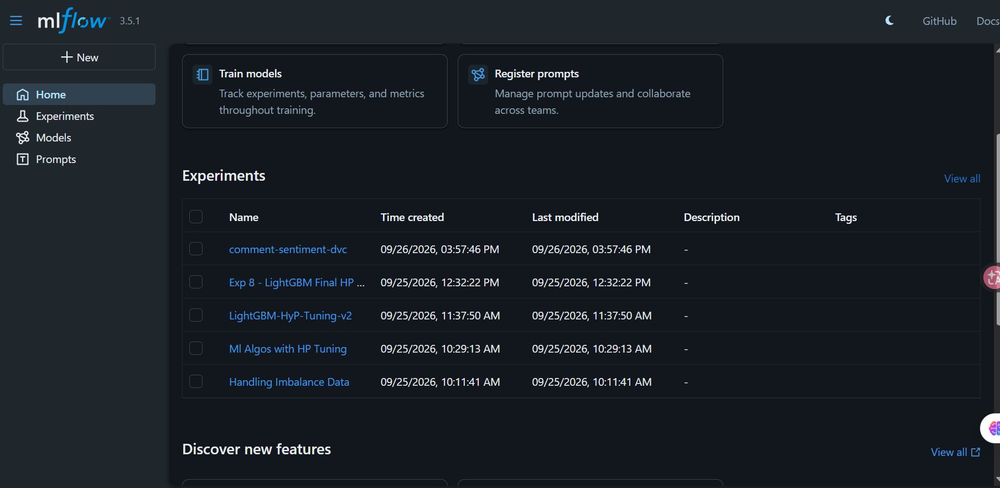
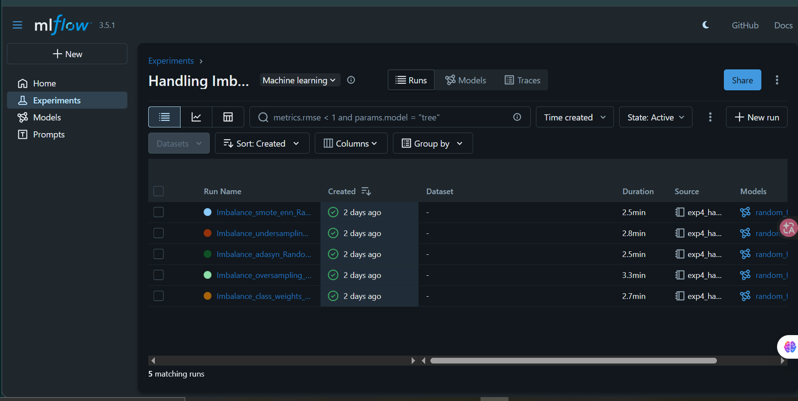
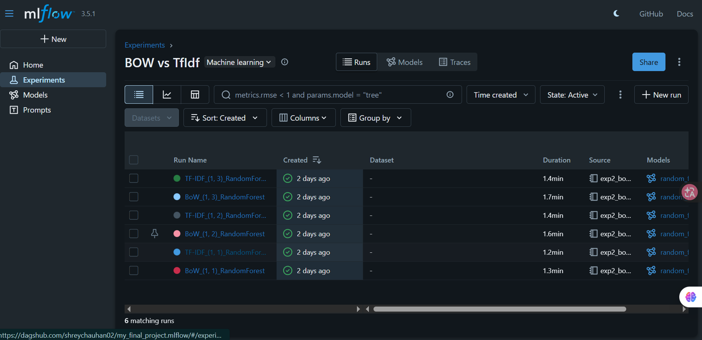
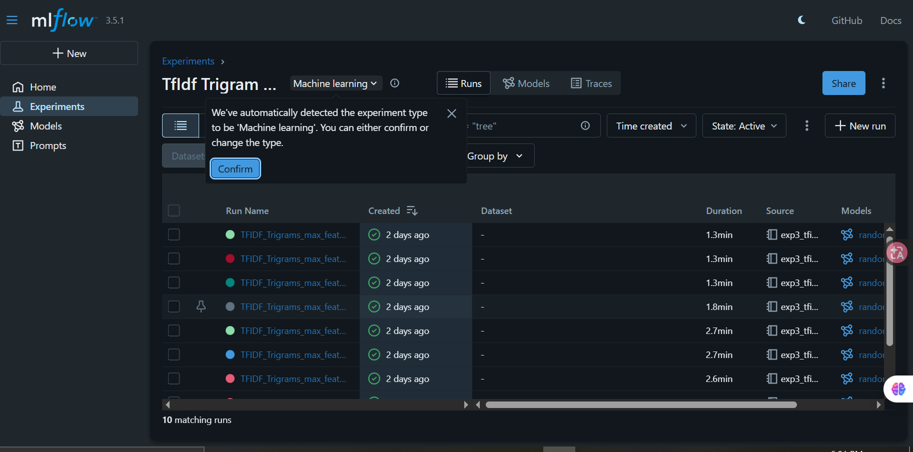
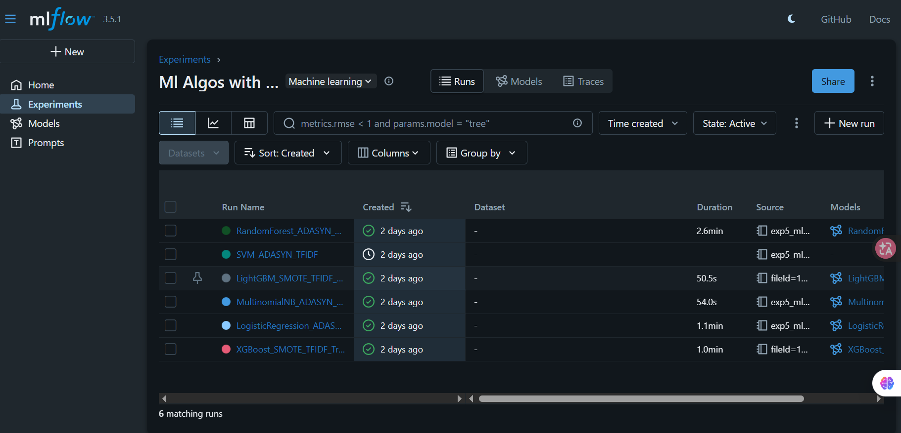
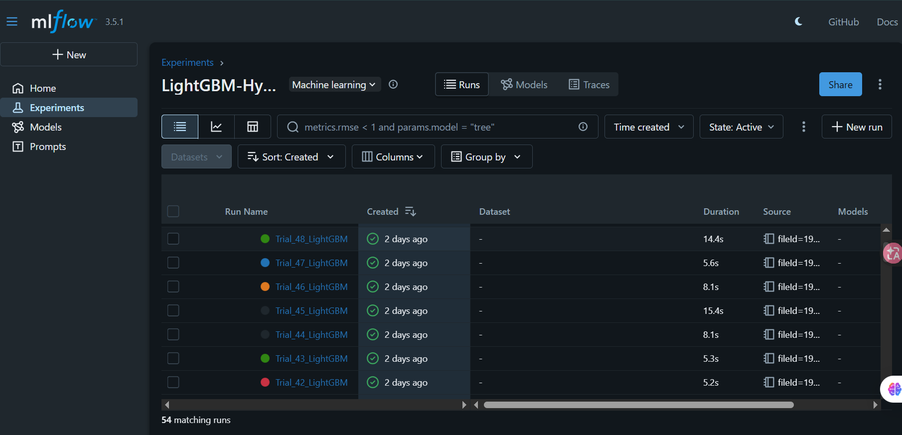

# YouTube Comment Sentiment Analysis

A Chrome Extension that analyzes the sentiment of YouTube comments in real-time and gives clear insights to content creators.

---

### The Problem

YouTube creators get views and likes, but they still don’t know how their audience actually *feels*.

YouTube Studio has basic AI comment search and moderation, but it doesn’t give:
- Clear Positive / Neutral / Negative breakdown
- Key themes & word cloud
- Sentiment trend over time
- Easy export of labeled comments

This project solves that.

---

### Features

- Real-time sentiment analysis (Positive / Neutral / Negative)
- Spam detection
- Word cloud + key themes
- Sentiment trend over time
- Gemini-powered audience summary
- Detailed comment-level insights
- One-click CSV export

---

### Screenshots

#### Chrome Extension UI


#### MLflow Experiments Overview


#### Handling Class Imbalance


#### Bag of Words vs TF-IDF


#### TF-IDF Trigram Experiments


#### Multiple Algorithms Comparison


#### LightGBM Hyperparameter Tuning (Optuna)


---

### Tech Stack & Experiments

**Models Tested**
- LightGBM
- XGBoost
- Random Forest
- Logistic Regression
- Multinomial Naive Bayes
- SVM

**Feature Engineering**
- Bag of Words vs TF-IDF (unigram to trigram)

**Class Imbalance Techniques**
- SMOTE + ENN
- ADASYN
- Oversampling
- Undersampling
- Class Weights

**Hyperparameter Tuning**
- Optuna (50+ LightGBM trials)

**MLOps**
- DVC pipeline
- MLflow experiment tracking
- Model registration on Dagshub
- FastAPI backend
- Chrome Extension (Manifest V3)

---

### Project Structure

```bash
├── extension/              # Chrome Extension
├── fastapi-backend/        # FastAPI server
├── src/                    # DVC pipeline code
├── models/                 # Trained models
├── screenshots/            # Project screenshots
├── dvc.yaml
├── params.yaml
└── explained.md            # Detailed technical explanation
